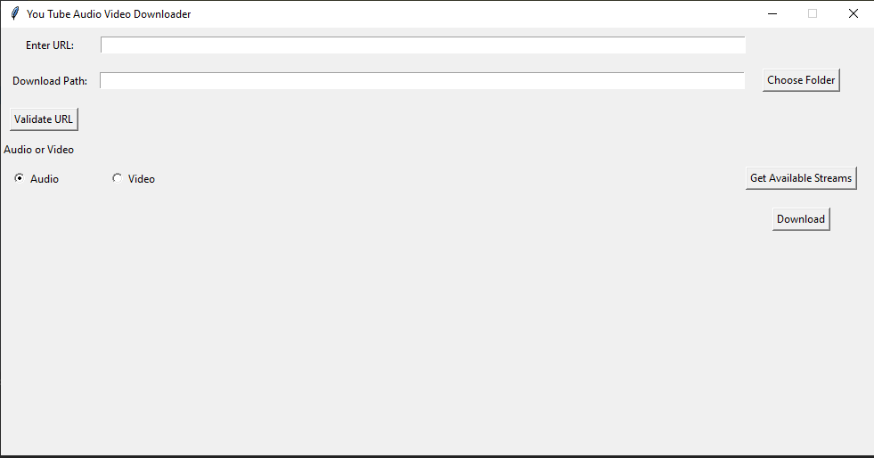

# YouTube Audio Video Downloader

The primary application of this project is to be able to **download audio/video streams** from a valid **YouTube URL**.


### Ways To Install
1. Download or Clone the source code to start with the installation.  
2. In the path to the root of the source code or `/path/../YTAV_Downloader/`, 
    install the requirements necessary for this module to work.  
        
     ```python -m pip install -r requirements.txt```
     
   The above command will install all the dependent python packages for YTAV module to work efficiently.

The installation will be complete with the step above. 

### How to Download an audio/video?
Run the script using the command 

    ```python ytav.py ```  
    
or on the editor of your choice run the python file `ytav.py`
    
An interface as given below will appear





Then follow the instructions as given below:
1. Enter a valid YouTube URL.
2. Choose the path at which you wish to download the stream
3. Click on Validate URL button
4. Choose Audio or Video from the list
5. Click on Get All Streams
6. From the available streams, choose any one
7. Click on Download. 
 
 
You will have the audio/video stream of your chosen quality downloaded at your chosen location.

### Future Improvement / Features 
1. Validate as soon a valid YouTube URL and path is provided. # Feature
2. Working on File Exists Error # Bug
3. Deal with Number of Video/Audio Streams
4. Adding A Download Progress bar
5. Preview with Video Details
6. Work on UX
  
  
